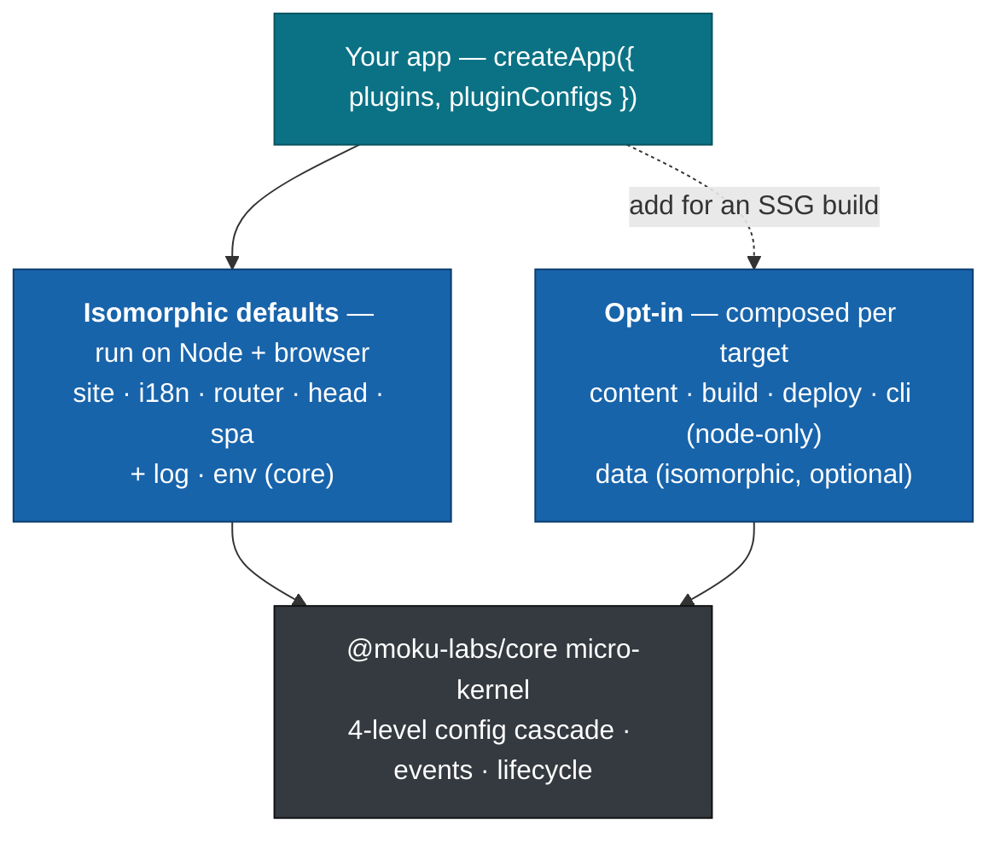
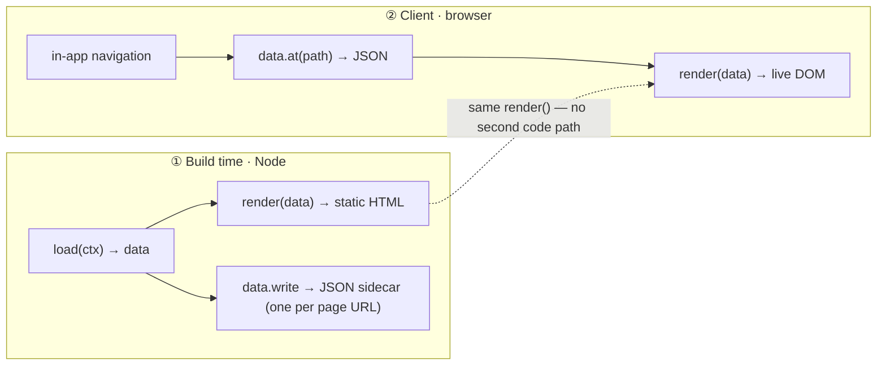

<div align="center">

# @moku-labs/web

**Content static-site generator + progressive SPA framework for TypeScript.**

Author Markdown, declare type-safe routes, ship SEO-complete static HTML —
then hydrate islands and navigate on the client. The *same* `render` runs at build and in the browser,
so SSG ⇄ SPA parity is structural, not duplicated.

Built on the [@moku-labs/core](https://github.com/moku-labs/core) micro-kernel — three layers of isolation, plugins all the way down, types doing the heavy lifting.

<br/>

[](https://github.com/moku-labs/web/actions/workflows/ci.yml)
[](https://www.npmjs.com/package/@moku-labs/web)
[](#requirements)
[](#the-browser-entry-is-guaranteed-node-free)
[](#requirements)
[](./LICENSE)

<br/>

[Quick start](#quick-start) ·
[How it works](#how-it-works) ·
[The route is the contract](#the-route-is-the-contract) ·
[Plugins](#plugins) ·
[Rendering modes](#rendering-modes) ·
[Scripts](#scripts) ·
[Docs](#docs)

</div>

---

```sh
bun add @moku-labs/web
```

> [!NOTE]
> **Status: `0.x` — pre-1.0.** The architecture is stable; the public API is settling but not yet frozen. Pin the version — the npm badge above tracks the current release.

## Why @moku-labs/web

- **SSG first, SPA when you want it.** Render [Preact](https://preactjs.com) pages to static HTML for SEO and instant first paint, then progressively enhance with island hydration and client-side navigation — opt in per project with a single switch.
- **The route is the contract.** One typed `route()` builder owns `load` → `render` → `head`. The build and the client run the *same* `render`, so there's no second code path to keep in sync. [Jump to the example ↓](#the-route-is-the-contract)
- **SEO complete out of the box.** Title templates, canonical + `hreflang`, Open Graph / Twitter cards, JSON-LD, RSS / Atom / JSON feeds, `sitemap.xml`, and generated OG images.
- **The `/browser` entry is guaranteed node-free.** A dedicated client entry whose static import graph references *zero* node modules — native code can never leak into your bundle, no matter your bundler or tree-shaking. A CI gate keeps it under budget (~50 kB gzip today, 60 kB budget). [Why this matters ↓](#the-browser-entry-is-guaranteed-node-free)
- **Plugins all the way down.** A tiny isomorphic core (`site`, `i18n`, `router`, `head`, `spa`) plus opt-in node-only plugins (`content`, `build`, `deploy`, `cli`), each [independently documented](#plugins) and composed in one `createApp` call.
- **Types do the heavy lifting.** `ctx.data` is inferred from your `.load()`, path params from the route pattern, plugin APIs from their specs — no codegen, no `as`.
- **i18n is built in.** Locale-aware routes, default-locale fallback, `hreflang` / `og:locale` maps.

## Quick start

A complete static blog is two files: the routes, and the app that builds them.

```tsx
// routes.tsx — the route IS the contract: load → render → head
import { route, contentPlugin } from "@moku-labs/web";
import { Article } from "./components";

export const home = route("/")
  .render(() => <h1>My Blog</h1>)
  .head(() => ({ title: "My Blog" }));

export const post = route("/{slug}/")
  // generate the page list at build time…
  .generate((ctx) => listSlugs(ctx.locale).map((slug) => ({ slug })))
  // …load() runs at build only; pull sibling plugins via ctx.require → widens ctx.data
  .load((ctx) => ctx.require(contentPlugin).load(ctx.params.slug, ctx.locale))
  // render() runs at build AND on the client; ctx.url builds type-safe links
  .render((ctx) => <Article article={ctx.data} url={ctx.url} />)
  .head((ctx) => ({ title: ctx.data.title, description: ctx.data.description }));
```

```ts
// app.ts — compose the build, then run it
import { createApp, contentPlugin, buildPlugin, fileSystemContent, processEnv } from "@moku-labs/web";
import * as routes from "./routes";

const app = createApp({
  plugins: [contentPlugin, buildPlugin],   // node-only plugins — opt in for the build
  config: { mode: "ssg" },                 // "ssg" | "spa" | "hybrid"  (see Rendering modes)
  pluginConfigs: {
    site:    { name: "My Blog", url: "https://blog.dev", author: "Me", description: "A personal blog." },
    i18n:    { locales: ["en"], defaultLocale: "en" },
    content: { providers: [fileSystemContent({ contentDir: "./content" })] },
    router:  { routes },                   // a declarative route map (an `import * as` namespace works)
    env:     { providers: [processEnv()] },
  },
});

await app.build.run();   // → dist/ : static HTML + feed.xml + sitemap.xml
```

Content lives on disk as `content/{slug}/{locale}.md` with YAML frontmatter. Drafts are excluded when `config.stage` is `production` (the default); they surface in `development` and `test`.

```
content/
  hello-world/
    en.md      # frontmatter: title, date, description, tags, language, draft?, author?
    uk.md      # same slug, another locale — i18n fallback handles the rest
  second-post/
    en.md
```

### Add client-side navigation

Import from the **`/browser`** entry. It's the same `createApp` over the same isomorphic defaults, with all node-only code excluded and `env` pre-wired — so `env` needs zero config.

```ts
// client.ts — guaranteed node-free; env reads import.meta.env out of the box
import { createApp, dataPlugin } from "@moku-labs/web/browser";
import * as routes from "./routes";   // render shells only — never the node content source

const app = createApp({
  plugins: [dataPlugin],              // opt in for DATA-driven navigation (mode spa | hybrid)
  config: { mode: "spa" },
  pluginConfigs: { router: { routes } },
});

await app.start();   // spa mounts islands onto the SSR'd DOM and intercepts navigation
```

## How it works

### Three layers, one `createApp`

You only ever touch **Layer 3**: a single `createApp` call. Defaults are the **isomorphic** plugins that run unchanged on Node *and* in the browser. The **node-only** plugins are exported but not defaults — you add them for a build. You never import from `@moku-labs/core` directly.



### The same `render` runs in both places

`build` calls each route's `load()` then `render()` to emit static HTML, and (in `spa`/`hybrid` mode) `data.write()` persists that page's `load()` output as a JSON sidecar. On a client navigation, `data.at()` fetches that JSON and `spa` re-runs the route's *own* `render` from it. One render function, two runtimes — parity is structural.



### The `/browser` entry is guaranteed node-free

There are two entry points, and the difference is a hard guarantee, not a tree-shaking hope:

| Entry | Format | For | Includes |
|---|---|---|---|
| **`@moku-labs/web`** | dual ESM + CJS | Node SSG builds | the full surface — add `content` / `build` / `deploy` / `cli` and wire `dotenv()` / `processEnv()` |
| **`@moku-labs/web/browser`** | ESM-only | client bundles | the same `createApp` over the same isomorphic defaults, plus `dataPlugin`, the route DSL, `createComponent`, `browserEnv`, and the SEO head primitives — **with all node-only code excluded** (`build` / `deploy` / `cli` and the `dotenv` / `processEnv` / `fileSystemContent` providers), and `browserEnv()` pre-wired as the default `env` provider |

Importing `@moku-labs/web/browser` can **never** drag node/native code into a client bundle, regardless of bundler or tree-shaking — its static import graph references zero node-only modules. This is stronger and more reliable than importing the main entry and relying on `"sideEffects": false`, where building entries together can merge node code into a shared chunk. (The browser entry keeps the `contentPlugin` *shell* so build-only loaders can `ctx.require(contentPlugin)`; the node Markdown source lives in `fileSystemContent`, which the entry does **not** export.) CI proves it:

```sh
bun run check:bundle   # asserts: zero static node/native imports + under the gzip budget
```

## The route is the contract

A route is a fluent builder. Each step is optional except `render`, and every type flows from it:

```ts
route("/{lang:?}/{slug}/")        // path-params are inferred → ctx.params.{lang, slug}
  .generate((ctx) => Params[])    // build-time: which concrete pages to emit
  .load((ctx) => Data)            // build-only: ctx.require / ctx.has pull sibling plugins; widens ctx.data
  .render((ctx) => VNode)         // build AND client: ctx.url builds links; ctx.data is typed from .load()
  .head((ctx) => HeadConfig)      // SEO <head>: ctx.url + ctx.data available
```

- **`ctx.params`** — inferred from the pattern. `{seg}` is required, `{seg:?}` is optional (used here for an optional locale prefix).
- **`ctx.require(plugin)` / `ctx.has(plugin)`** — pull a sibling plugin's API the spec way (instance-only, no module globals). Available in `load` / `generate`.
- **`ctx.url(name, params)`** — type-safe link builder. Available in `render` / `head`.
- **`ctx.data`** — typed from `.load()`'s return. On a client nav the fetched JSON *is* `ctx.data` directly (no validation step); a missing or malformed sidecar simply falls back to HTML-over-fetch. Omit `.load()` for a static page — `build` still emits an empty `{}` sidecar so hybrid nav resolves cleanly.

Register routes declaratively via `pluginConfigs.router.routes` — the single source of truth, compiled once at init.

SEO `<head>` primitives are exported for `.head()` handlers: `meta`, `og`, `twitter`, `jsonLd`, `canonical`, `hreflang`, `feedLink`, and `buildArticleHead`.

## Plugins

Each plugin is small, single-purpose, and documented on its own. **Click a name for its README** — config, full API, and design notes.

| Plugin | Kind | Responsibility |
|---|---|---|
| [`site`](src/plugins/site/README.md) | isomorphic default | Global, frozen site identity (name, URL, author) + canonical URL helper |
| [`i18n`](src/plugins/i18n/README.md) | isomorphic default | Locale registry, default-locale fallback, translations, `og:locale` map |
| [`router`](src/plugins/router/README.md) | isomorphic default | Type-safe `route()` DSL, path-param inference, matcher, URL/file derivation, `mode()` |
| [`head`](src/plugins/head/README.md) | isomorphic default | `<head>` composition: title template, canonical, OG/Twitter, JSON-LD, `hreflang`, feeds |
| [`spa`](src/plugins/spa/README.md) | isomorphic default | Client runtime: island hydration + intercepted navigation + progress bar (inert on Node) |
| [`content`](src/plugins/content/README.md) | node-only | Markdown → sanitized HTML pipeline, frontmatter, reading time, locale-keyed `Article` model |
| [`build`](src/plugins/build/README.md) | node-only | SSG orchestrator: pages, feeds (RSS/Atom/JSON), sitemap, OG images → `dist/` |
| [`deploy`](src/plugins/deploy/README.md) | node-only | Cloudflare Pages: `wrangler.jsonc` scaffolding, secret scrubbing, deploy |
| [`cli`](src/plugins/cli/README.md) | node-only | Developer CLI — `build` / `serve` / `preview` / `deploy` with the animated Velocity Panel UI (lockup + version banner, live phase tree, boxed panels, live pulse) |
| [`data`](src/plugins/data/README.md) | optional provider | Agnostic `page path → JSON` contract: `write()` on Node, `at()` in the browser, for DATA nav |
| [`env`](src/plugins/env/README.md) | core | Multi-provider environment / secret injection, validated and frozen at `onInit` |
| [`log`](src/plugins/log/README.md) | core | Structured logging + an in-memory trace with an `expect()` DSL for testable workflows |

## Rendering modes

One global switch — `config.mode` (default `hybrid`), read by plugins via `router.mode()` — decides how much of the SPA machinery runs.

| Mode | Build emits | Client behavior | Use for |
|---|---|---|---|
| `ssg` | HTML only | static pages (full reload on nav) | content sites, docs, marketing |
| `spa` | HTML + JSON sidecars | DATA navigation: fetch JSON, re-render in place | app-like sites |
| `hybrid` | HTML + JSON sidecars | DATA nav where available, else HTML-over-fetch | best of both |

> [!TIP]
> Compose `dataPlugin` on **both** sides for DATA navigation — on Node so `build` can write sidecars, and on the browser entry so `spa` can read them. Omit it for a plain static site. It has no hard dependencies and tree-shakes away when unused.

## Scripts

```sh
bun run build              # build with tsdown (dual ESM+CJS + ESM-only browser entry)
bun run test               # all tests (vitest)
bun run test:unit          # unit tests only
bun run test:integration   # integration tests only
bun run test:coverage      # tests with coverage (90% threshold)
bun run lint               # biome check + eslint
bun run lint:fix           # auto-fix lint issues
bun run format             # format with biome
bun run validate           # publint — verify package export map
bun run check:bundle       # assert the browser bundle is node-free + under the gzip budget
```

## Requirements

- **Node `>= 24`** — the router uses the global [`URLPattern`](https://developer.mozilla.org/docs/Web/API/URLPattern).
- **Bun `>= 1.3.14`** — the package manager and test runner. Use `bun` exclusively (never npm/yarn/pnpm).
- **TypeScript** in strict mode, with `exactOptionalPropertyTypes` and `noUncheckedIndexedAccess`.

## Docs

- **Per-plugin internals** — the linked READMEs in the [Plugins](#plugins) table.
- **Architecture & specifications** — the [@moku-labs/core specification](https://github.com/moku-labs/core/tree/main/specification).
- **For AI agents / LLM codegen** — [`llms.txt`](./llms.txt) (concise) and [`llms-full.txt`](./llms-full.txt) (complete), plus the Moku Claude toolkit described in [`CLAUDE.md`](./CLAUDE.md).
- **Contributing** — see [`CLAUDE.md`](./CLAUDE.md) for code style, the three-layer model, and the test layout.

## License

[MIT](./LICENSE) © [moku-labs](https://github.com/moku-labs)
